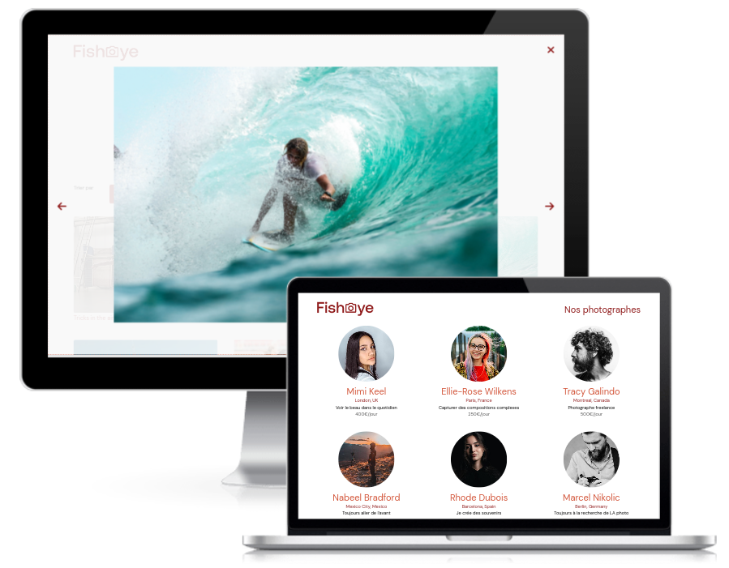

# oc-p6-fisheye
This project is the n°6 in the [OpenClassrooms Front-End learning path](https://openclassrooms.com/fr/paths/516-developpeur-dapplication-javascript-react).

Create an accessible site for a platform of photographers : 
- Modernize the **FishEye** photographers website into a dynamic site with Javascript: design patterns, json, modal, gallery, sorting
- Make it accessible: focus, keyboard navigation, ARIA

## ✨ Demo
- https://jeromeabel.github.io/oc-p6-fisheye/

## 🚀 Usage
Just open the index.html in your browser and you can click differents photographer pages. You can also open pictures in a slider and click on the heart icon to add your favorite.

## 👤 Author

- [@jeromeabel](https://github.com/jeromeabel)

## 📝 License

- [GNU--GPL--3](https://www.gnu.org/licenses/gpl-3.0.fr.html)